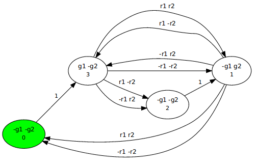

# Tool description

The synthesizer works as follows:

1) Parse the specification that describes inputs, outputs, and CTL* formula F.
   For this, we use files in python format.

2) Convert F into a hesitant tree automaton using the procedure described in [^1],
   using LTL3BA to convert path formulas into NBWs.

3) For each system size k in increasing order:

   - encode "is there M_k: M_k * AHT != 0?" into SMT
     using Eq.5 where |M_k| = k.

   - call Z3 solver:
     if the solver returns "unsatisfiable", goto next iteration;
     otherwise print the model in the dot graph format.


# Example

Consider the specification from file `resettable_arbiter1.py`:

```
from helpers.spec_helper import *
from interfaces.spec import Spec

rs1, r1 = sig_prop('r1')
gs1, g1 = sig_prop('g1')
rs2, r2 = sig_prop('r2')
gs2, g2 = sig_prop('g2')

inputs = [rs1,rs2]
outputs = [gs1,gs2]

formula = ~g1 & ~g2 & \
          AG((r1 >> F(g1)) & (r2 >> F(g2))) & \
          AG(~(g1&g2)) & \
          AGEF(~g1&~g2&~r1&~r2)

spec = Spec(inputs, outputs, formula)
```

Some techicality:
`rs1` means an object of class `Signal`,
while `r1` means the proposition `rs1 = True`;
also: `>>` denotes implication, `~` means negation,
and backslash is used to merge multi-lines into one.

To run it, from the tool root folder call

`python3 ./star.py ./experiments-for-tacas/resettable_arbiter1.py --dot model.dot`

(Call `python3 ./star.py --help` to see all possible parameters.)

You should get logs like
```
15:09:02  Namespace(bound=128, dot=None, incr=False, log=None, size=0, spec='./experiments-for-tacas/resettable_arbiter1.py', tmp=False, verbose=0)
15:09:02  check_real
15:09:02  ctl2aht: 
 inputs: {r1, r2}
 outputs: {g2, g1}
 formula: !(g1=1) * !(g2=1) * A(G(!(r1=1) + F(g1=1) * !(r2=1) + F(g2=1))) * A(G(!(g1=1 * g2=1))) * A(G(E(F(!(g1=1) * !(g2=1) * !(r1=1) * !(r2=1)))))
15:09:02  replace_top_AEs
15:09:02  ctl2aht: 
 inputs: {r1, r2}
 outputs: {g2, g1}
 formula: E(F(A(G(g1=1 + g2=1 + r1=1 + r2=1))))

[cut away some logs]

15:10:35  The AHT automaton size (nodes/transitions) is: 13/24
15:10:35  search
15:10:35  searching a model of size 1..
15:10:36  solve
15:10:36  solving /home/ayrat/projects/party-elli/tmpvk05_g1q1.smt2
15:10:36  searching a model of size 2..
15:10:36  solve
15:10:36  solving /home/ayrat/projects/party-elli/tmpvk05_g1q1.smt2
15:10:36  searching a model of size 3..
15:10:36  solve
15:10:36  solving /home/ayrat/projects/party-elli/tmpvk05_g1q1.smt2
15:10:36  _parse_sys_model
15:10:36  FOUND model for sys
15:10:36  Moore model is written to model.dot
```

Most of the logs (that are cut) are taken by messages about translation of CTL* into AHT
-- this is also the most difficult part to implement.

After getting an AHT, at moment `15:10:35`, the tool starts SMT solving.
In this example, the smallest model is of size 3.
The model is written into `model.dot` which looks like
(it may differ in your case, since there are many different models satisfying this spec,
 but the size should be 3):

  

That is all.

The folder `experiments-for-tacas` contains other specifications to try out.
They are all realizable -- on unrealizable specs the tool does not terminate
(hangs in iterating over model sizes).

If you wonder about alternating hesitant automata -- see small note in [aht.md](aht.md).


  [^1]: Kupferman, O., Vardi, M.Y., Wolper, P.: An automata-theoretic approach to branching-time model checking.
