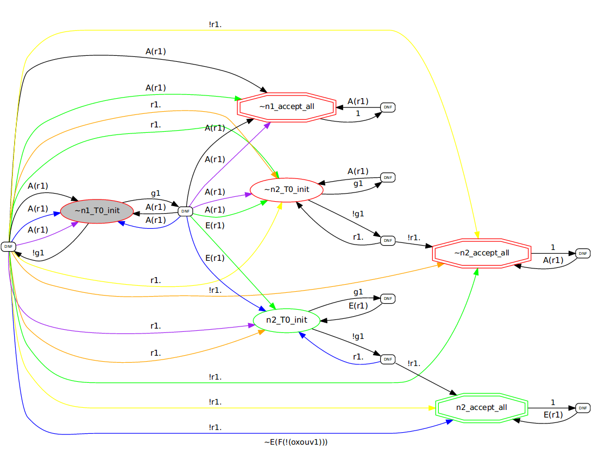

# AHT automaton for `AGEF(~g1~r1)`

PARTY converts `AGEF(~g1~r1)` into the following alternating hesitant automaton (AHT):

  

It's initial state is `~n1_T0_init` (grayed).
Red lining means the state is "universal",
green (like "n2_accept_all") means the state is "existential".
Double lined states are final.
Final "existential" states means that we need to visit
such states infinitely often,
final "universal" states -- avoid visiting them infinitely often.
Reminder:
an AHT path is accepting iff it visits some green final state infinitely often
or it avoids visiting some red state infinitely often.
Falling out of the red state is good,
falling out of the green state is bad.

The small rounded boxes "DNF" are used to distinct
edges with state labels and direction labels
-- together all edges after "DNF" describe the boolean formula
over Directions*States.
For example, consider transitions from `~n1_T0_init` with state label `g1`:

```
( (ForAll(r1): (r1,~n1_accept_all)) & (ForAll(r1): (r1,~n2_T0_init)) ) OR
( (ForAll(r1): (r1,~n1_accept_all)) & (ForAll(r1): (r1,~n1_T0_init)) ) OR
( (ForAll(r1): (r1,~n2_T0_init)) & (Exists(r1): (r1,n2_T0_init)) ) OR
( (ForAll(r1): (r1,~n1_T0_init)) & (ForAll(r1): (r1,n2_T0_init)) )
```

The first line corresponds to <font color="Purple">purple</font> edges,
the second line -- to <font color="Black">black</font> edges,
the third -- to <font color="Green">green</font> edges,
the last -- to <font color="Blue">blue</font> edges.

Thus, edges of the same color represent "literals" from the same cube,
where the overall formula is a disjunction of cubes.

For now PARTY does not implement any automata optimizations.

You can print AHTs in dot format using the function `helpers.aht2dot.convert(..)`,
but note that it can very slow due to long conversion time of boolean formulas into DNF (I use package `sympy` for this).
