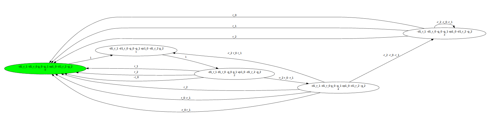
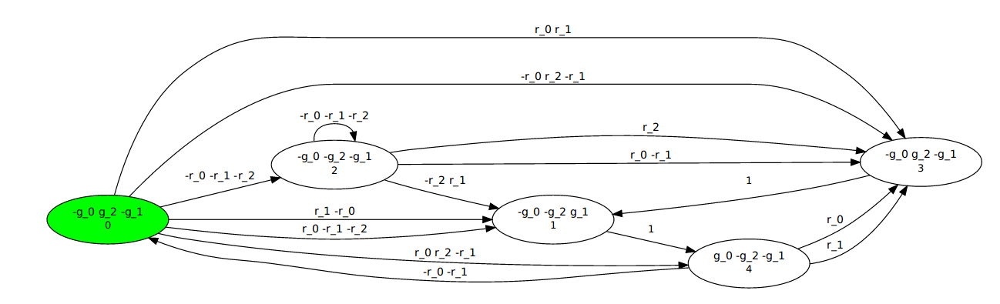

The translator from CTL* synthesis problem to LTL synthesis problem
is implemented in `ctl_to_ltl.py`.
It accepts CTL* in python format and outputs LTL in the TLSF format.
This folder `experiments-for-synt` contains some python benchmarks (CTL*),
as well as already translated LTL variants.

For example, run it on `loop_arbiter_2.py` (assuming you are in the synt folder):
```
../ctl_to_ltl.py ./simple_res_arb_3.py --star --k 1 --out hoho.tlsf
```

This should produce something like:
```
ayrat@hell:~/projects/party-elli/experiments-for-synt$ ../ctl_to_ltl.py ./simple_res_arb_3.py --star --k 1 --out hoho.tlsf
18:06:50  Namespace(k=1, log=None, out='hoho.tlsf', spec='./simple_res_arb_3.py', star=True, verbose=0)
18:06:50  Input spec:
inputs: '{r_0, r_1, r_2}', outputs: '{g_1, g_0, g_2}', formula: 'A(G(!(g_0=1) + !(g_1=1 + g_2=1)) * G(!(g_1=1) + !(g_0=1 + g_2=1)) * G(!(g_2=1) + !(g_0=1 + g_1=1)) * G(!(r_0=1) + F(g_0=1)) * G(!(r_1=1) + F(g_1=1)) * G(!(r_2=1) + F(g_2=1))) * A(G(E(F(G(!(g_0=1 + g_1=1 + g_2=1))))))''
18:06:50  k = 1
18:06:50  introduced outputs:
{__d1_r_1, __d1_r_0, __vp1_0, __d1_r_2}
18:06:50  LTL
(((((G((!(g_0)) || ((!(g_1)) && (!(g_2))))) && (G((!(g_1)) || ((!(g_0)) && (!(g_2)))))) && (G((!(g_2)) || ((!(g_0)) && (!(g_1)))))) && (((G((!(r_0)) || (F(g_0)))) && (G((!(r_1)) || (F(g_1))))) && (G((!(r_2)) || (F(g_2)))))) && (G(__vp1_0))) && (G((!(__vp1_0)) || ((!(G(((((!(__d1_r_0)) || (r_0)) && ((!(r_0)) || (__d1_r_0))) && (((!(__d1_r_1)) || (r_1)) && ((!(r_1)) || (__d1_r_1)))) && (((!(__d1_r_2)) || (r_2)) && ((!(r_2)) || (__d1_r_2)))))) || (F(G(((!(g_0)) && (!(g_1))) && (!(g_2))))))))

    INFO {
      TITLE: "title"
      DESCRIPTION: "Generated from CTL* by Party"
      SEMANTICS: Moore
      TARGET: Moore
    }
    MAIN {
      INPUTS { r_0; r_1; r_2; }
      OUTPUTS { __d1_r_0; __vp1_0; g_1; g_2; g_0; __d1_r_1; __d1_r_2; }
      GUARANTEES {
        (((((G((!(g_0)) || ((!(g_1)) && (!(g_2))))) && (G((!(g_1)) || ((!(g_0)) && (!(g_2)))))) && (G((!(g_2)) || ((!(g_0)) && (!(g_1)))))) && (((G((!(r_0)) || (F(g_0)))) && (G((!(r_1)) || (F(g_1))))) && (G((!(r_2)) || (F(g_2)))))) && (G(__vp1_0))) && (G((!(__vp1_0)) || ((!(G(((((!(__d1_r_0)) || (r_0)) && ((!(r_0)) || (__d1_r_0))) && (((!(__d1_r_1)) || (r_1)) && ((!(r_1)) || (__d1_r_1)))) && (((!(__d1_r_2)) || (r_2)) && ((!(r_2)) || (__d1_r_2)))))) || (F(G(((!(g_0)) && (!(g_1))) && (!(g_2))))))));
      }
    }
    
18:06:50  output TLSF is written to: hoho.tlsf
```

Now you can check that TLSF file, and run an LTL synthesiser on it.
Let us run `elli.py` (bounded synthesiser that follows Schewe/Finkbeiner approach):
```
ayrat@hell:~/projects/party-elli/experiments-for-synt$ ../elli.py --incr ./hoho.tlsf 
18:07:59  Namespace(bound=32, dot=None, incr=True, log=None, maxK=0, moore=True, size=0, spec='./hoho.tlsf', spot=True, tmp=False, unreal=False, verbose=0)
18:07:59  created z3 process: 20064
18:07:59  LTL formula size: 78
18:07:59  automaton size is: 7
18:07:59  using CoBuchiEncoder
18:07:59  search
18:07:59  searching a model of size 1..
18:07:59  solving the query..
18:07:59  searching a model of size 2..
18:07:59  solving the query..
18:07:59  searching a model of size 3..
18:07:59  solving the query..
18:07:59  searching a model of size 4..
18:08:00  solving the query..
18:08:16  searching a model of size 5..
18:08:16  solving the query..
18:08:20  parse_model
18:08:20  searching a model took (sec): 20
18:08:20  FOUND model for sys of size 5
18:08:20  digraph module {
 rankdir=LR;

"0" [label="-__d1_r_1 -__d1_r_0 g_0 -g_1 __vp1_0 -__d1_r_2 -g_2\n0", fillcolor="green", style=filled]
"1" [label="-__d1_r_1 -__d1_r_0 -g_0 -g_1 __vp1_0 -__d1_r_2 g_2\n1"]
"2" [label="-__d1_r_1 __d1_r_0 -g_0 g_1 __vp1_0 -__d1_r_2 -g_2\n2"]
"3" [label="-__d1_r_1 -__d1_r_0 -g_0 -g_1 __vp1_0 -__d1_r_2 -g_2\n3"]
"4" [label="-__d1_r_1 -__d1_r_0 g_0 -g_1 __vp1_0 -__d1_r_2 -g_2\n4"]
"0" -> "1" [label="1"]
"2" -> "0" [label="r_1"]
"2" -> "0" [label="r_2"]
"2" -> "0" [label="-r_0"]
"1" -> "2" [label="1"]
"3" -> "3" [label="-r_2 -r_0 -r_1"]
"4" -> "3" [label="-r_2 -r_0 -r_1"]
"3" -> "0" [label="r_0"]
"3" -> "0" [label="r_1"]
"3" -> "0" [label="r_2"]
"4" -> "1" [label="-r_2 r_0 r_1"]
"2" -> "4" [label="-r_2 r_0 -r_1"]
"4" -> "0" [label="r_2"]
"4" -> "0" [label="r_0 -r_1"]
"4" -> "0" [label="-r_0 r_1"]
}
```
You can save the result into dot file and look at it using for example `xdot`.
Here is what it looks like:

  

Notice that the model contains additional outputs not mentioned in the original CTL* specification --- remember we synthesise the explicit models and these new labels are used to guide the (now deterministic) verifier.

Below is what the CTL* synthesiser `star.py` produced (using command `../star.py --incr ./simple_res_arb_3.py`):
 
 

The folder `experiments-for-synt/logs/` contains the logs
of running my synthesisers on the CTL* specs and on the translated TLSF specs.
The paper's table uses the information from those logs.

