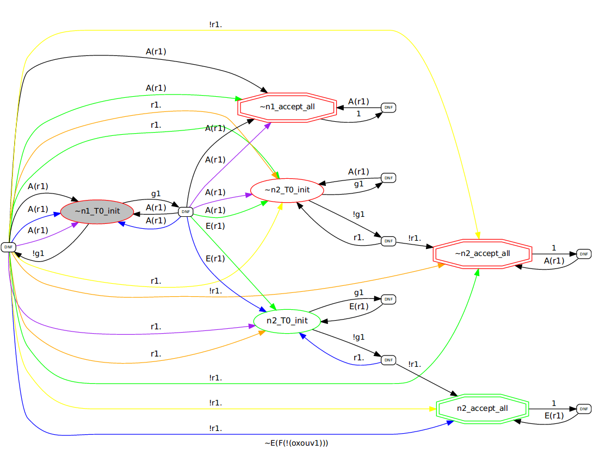

# AHT automaton for AGEF(~g1~r1)

PARTY converts `AGEF(~g1~r1)` into the following alternating hesitant automaton (AHT):

  

It's initial state is `~n1_T0_init` (grayed).
Red lining means the state is "universal",
green (like "n2_accept_all") means the state is "existential".

The small rounded boxes "DNF" are used to distinct
edges with state labels and direction labels
-- together all edges after "DNF" describe the boolean formula
over Directions*States.
For example, consider transitions with state label `g1`:

`( (ForAll(r1): (r1,~n1_accept_all)) & (ForAll(r1): (r1,~n2_T0_init)) ) OR ` \

`( (ForAll(r1): (r1,~n1_accept_all)) & (ForAll(r1): (r1,~n1_T0_init)) ) OR ` \

`( (ForAll(r1): (r1,~n2_T0_init)) & (Exists(r1): (r1,n2_T0_init)) ) OR ` \

`( (ForAll(r1): (r1,~n1_T0_init)) & (ForAll(r1): (r1,n2_T0_init)) )`

The first line corresponds to magenta edges,
the second line -- to  edges,
the third -- to  edges,
the last -- to  edges.

Thus, edges of the same color represent "literals" from the same cube,
where the overall formula is a disjunction of cubes.

For now PARTY does not implement any automata optimizations.

You can print AHTs in dot format using the function `helpers.aht2dot.convert(..)`,
but note that it can very slow due to long conversion time of boolean formulas into DNF (I use package `sympy` for this).
